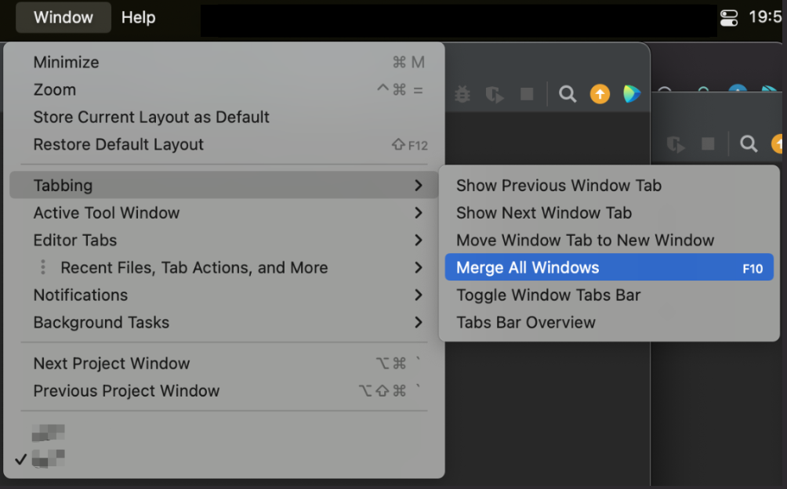

# IDEA Mac Tabbing

<!-- Plugin description -->
Add Mac tabbing options to Jetbrains IDEs:
- Show Previous Window Tab
- Show Next Window Tab
- Move Window Tab to New Window
- Merge All Windows
- Toggle Window Tabs Bar
- Tabs Bar Overview

Tested with CLion 2021.3.4 && Intellij 2021.3.2
<!-- Plugin description end -->

## Installation
  
- Manually:

  Download the [latest release](https://github.com/wDCat/idea-mac-tabbing/releases/latest) and install it manually using
  <kbd>Settings/Preferences</kbd> > <kbd>Plugins</kbd> > <kbd>⚙️</kbd> > <kbd>Install plugin from disk...</kbd>

- Or build from source if you like.

---
Plugin based on the [IntelliJ Platform Plugin Template][template].

[template]: https://github.com/JetBrains/intellij-platform-plugin-template
